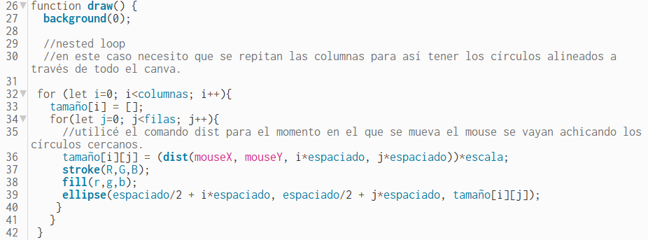
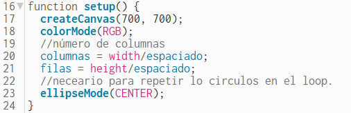
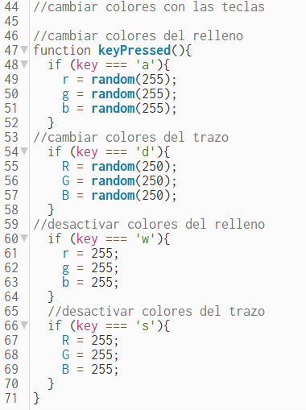
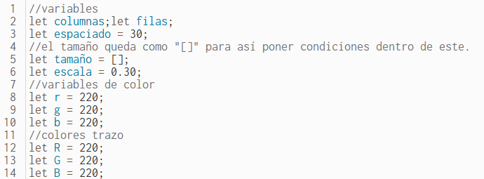
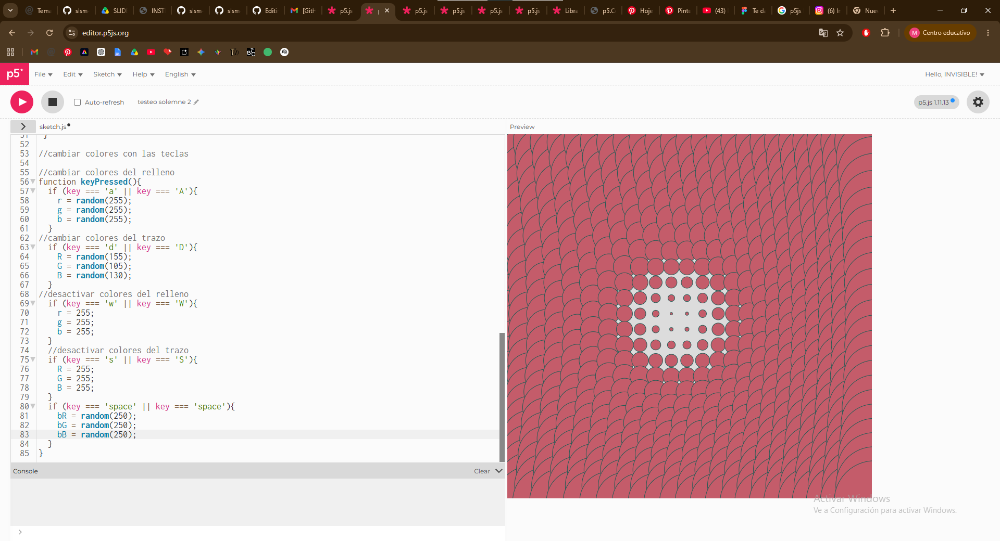
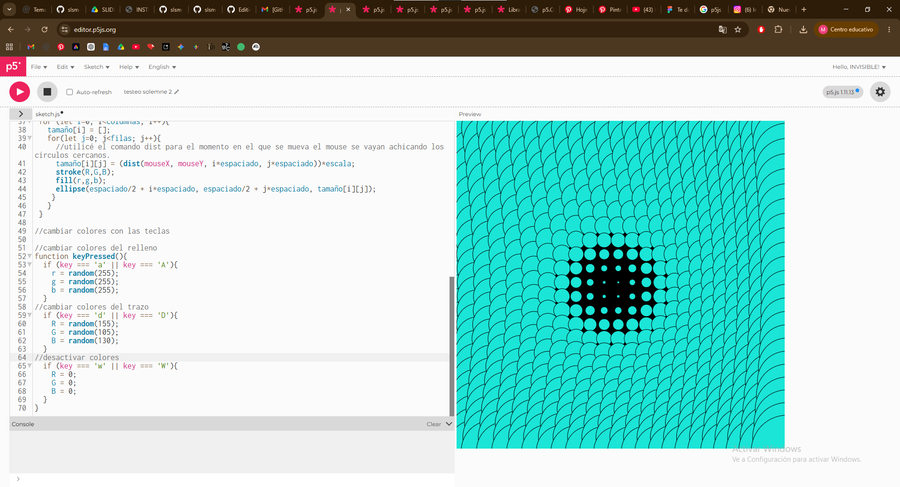
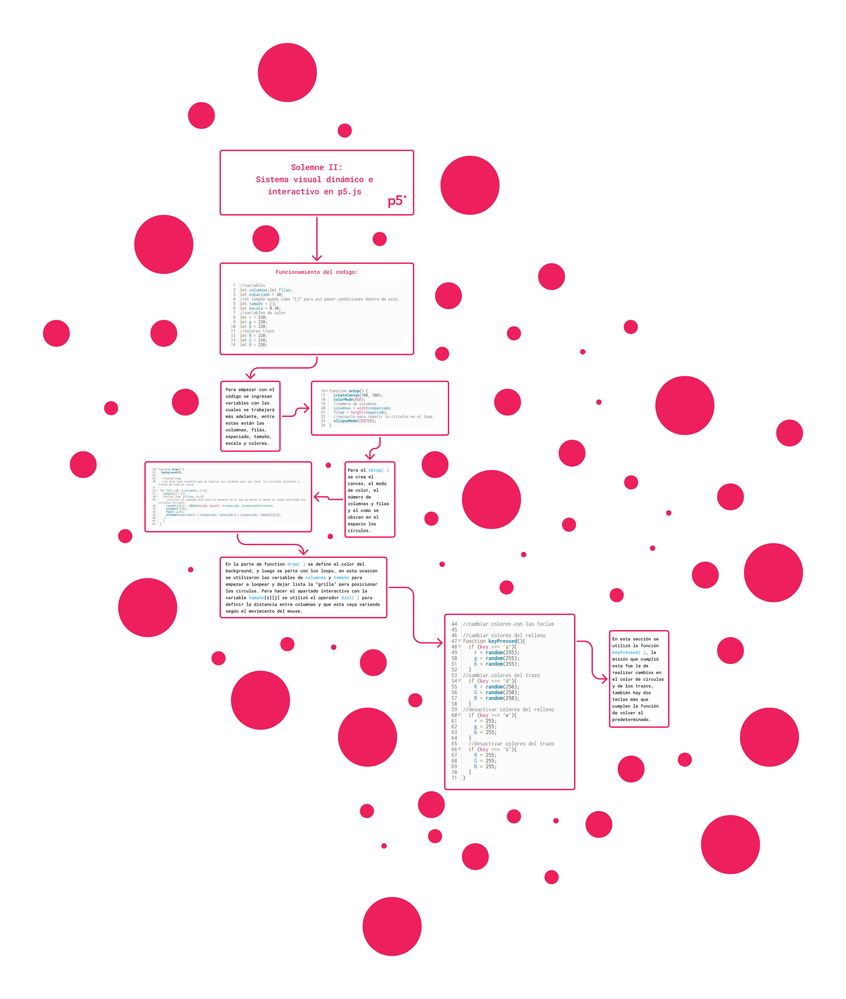
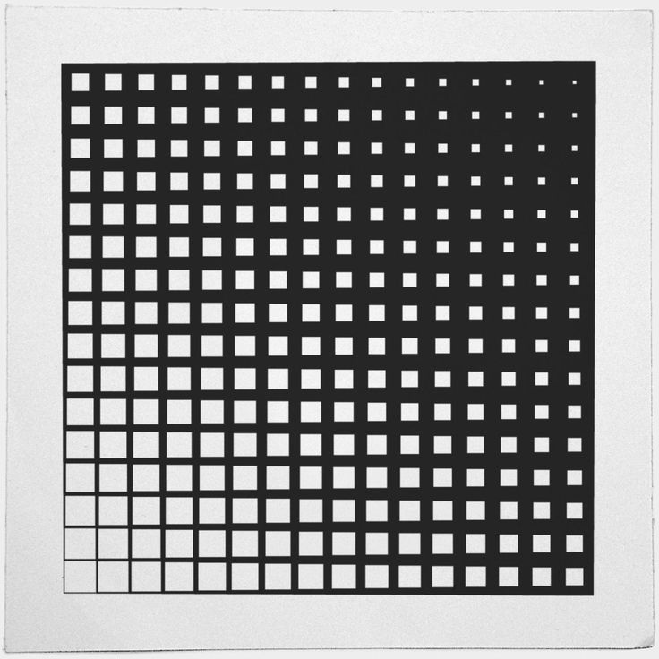
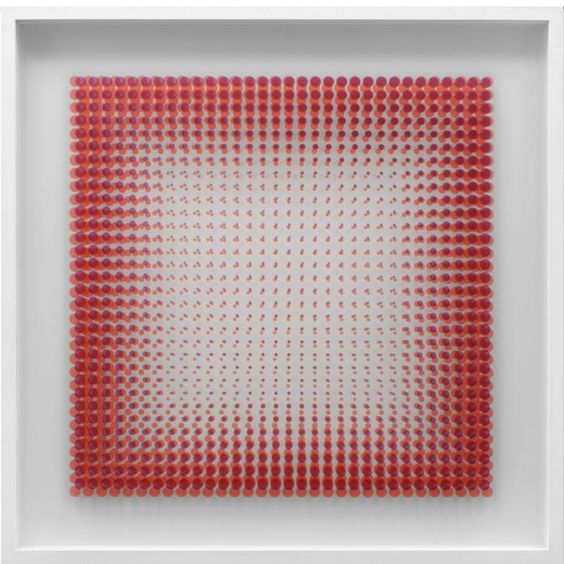
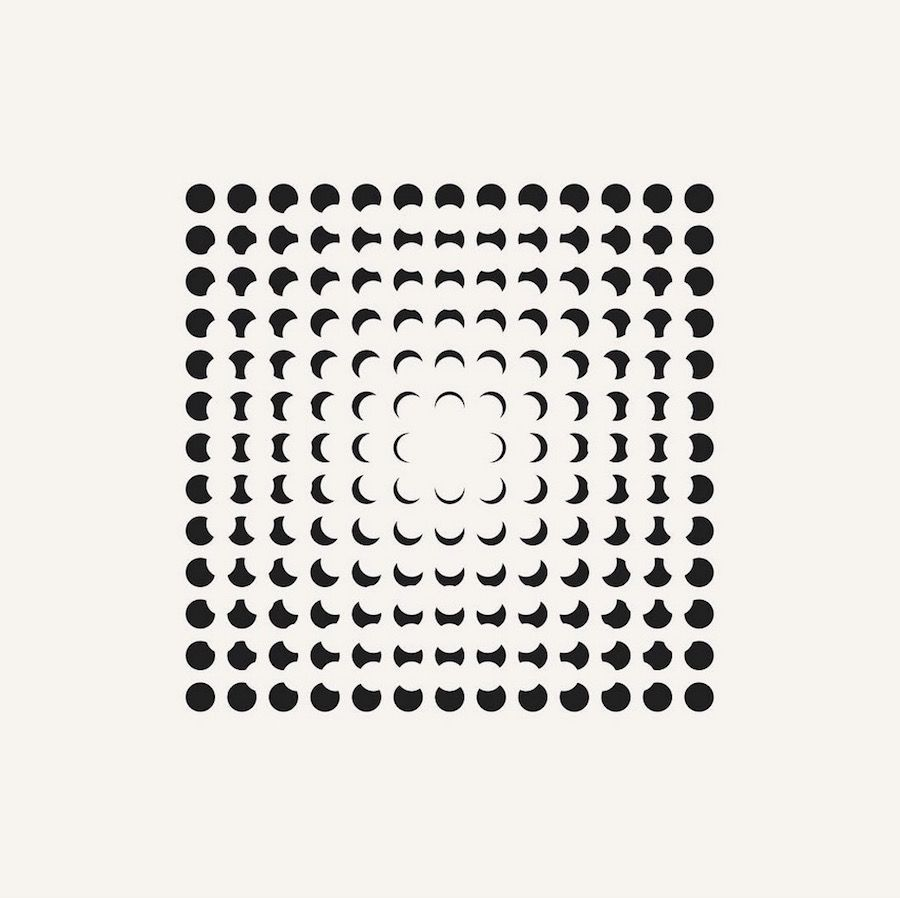

# Pensamiento Computacional

Bitacora del ramo pensamiento computacional.

# Solemne II: Codigo Interactivo

## Nombre del proyecto: DISPERSIÓN

**Autor:** Matías Padilla

**LINK:** [link](https://editor.p5js.org/INVISIBLE/sketches/Y6NFY6kmh)

## Descripción objetiva:

Con los referentes en mente, ideé una manera para llegar al resultado que necesitaba, para esto debía hayar
la forma para posicionar correctamente los círculos en todo el canvas, para esto, utilicé una herramienta
vista en clases la cual era el nested loop for(let), esto me permite hacer repeticiones de elementos las veces que
considere necesaria.

Con esta secuencia utilizando las variables que asigné para columnas y filas en el loop hice que se repartieran los circulos
de manera ordenada alrededor de todo el canvas. También hice que las elipses estuvieran en modo CENTER, para que así cada una
se posicionara automaticamente centradas y no tener que estar asignando el eje X e Y.

En cuanto a inputs, hice uso de varios, entre estos el uso del mouse, el cual cumple la función de ir deformando las grillas,
haciendo que los elementos ubicados dentro de esta se achiquen (output), también están los inputs de uso de teclas, tales como
las teclas 'WASD', estas cumplen principalmente la función de cambiar los colores de los círculos, por ejemplo; la tecla **'A'**
cambia los colores del relleno de los círculos y la tecla **'D'** cambia el color del trazo de estos. En cuanto a la funcionalidad
de las teclas W y S, la primera se encarga de "desactivar" los colores del relleno, y la segunda cumple lo mismo pero con los trazos.

Esto funciona a través de variables, donde r,g y b son los encargados de cambiar especificamente los colores de relleno de los círculos,
y los R,G y B se encargan del color de los trazos de estos.

Leugo de todo este proceso llegué al resultado que buscaba, el cual era generar un espacio interactivo el cual muestre figuras geometricas
siendo deformadas y cambiadas de color.

**Algunos procesos que no salieron como quería pero dejé registro para documentar:**

En esta imagen se puede ver como intenté hacer variaciones en el color del background, pero simplemente no resultó como quería, así que
lo descarté.

Estas fueron las primeras pruebas de inputs para poder desactivar los colores de los rellenos y trazos, por lo que se puede ver intenté asignarle
colores rgb a un fondo el cual funciona con blancos y negros. Como solución opté por cambiar a color blanco el relleno y trazo de los círculos en vez
de hacer un cambio en el background.

# **Código:**

//variables
let columnas;let filas;
let espaciado = 30;
//el tamaño queda como "[]" para así poner condiciones dentro de este.
let tamaño = [];
let escala = 0.30;
//variables de color
let r = 220;
let g = 220;
let b = 220;
//colores trazo
let R = 220;
let G = 220;
let B = 220;

function setup() {
  
  createCanvas(700, 700);
  
  colorMode(RGB);
  
  //número de columnas
  columnas = width/espaciado;
  filas = height/espaciado;
  
  //neceario para repetir lo circulos en el loop.
  ellipseMode(CENTER);
}

function draw() {
  background(0);
  
  //nested loops
  
  //en este caso necesito que se repitan las columnas para así tener los círculos alineados a través de todo el canva.
  
   for (let i=0; i<columnas; i++){
   tamaño[i] = [];
   for(let j=0; j<filas; j++){
     
  //utilicé el comando dist para el momento en el que se mueva el mouse se vayan achicando los círculos cercanos.   
  tamaño[i][j] = (dist(mouseX, mouseY, i*espaciado, j*espaciado))*escala;
  stroke(R,G,B);
  fill(r,g,b);
  ellipse(espaciado/2 + i*espaciado, espaciado/2 + j*espaciado, tamaño[i][j]);
     }  
   }
 } 

//condicionales
//cambiar colores con las teclas

//cambiar colores del relleno
function keyPressed(){
  if (key === 'a'){
    r = random(255);
    g = random(255);
    b = random(255);
  }
//cambiar colores del trazo  
  if (key === 'd'){
    R = random(250);
    G = random(250);
    B = random(250);
  }
//desactivar colores del relleno
  if (key === 'w'){
    r = 255;
    g = 255;
    b = 255;
  }
  //desactivar colores del trazo
  if (key === 's'){
    R = 255;
    G = 255;
    B = 255;
  }
}
## Diagrama de flujo:

## Descripción conceptual:

 **Referentes**

Para la solemne II de pensamiento computacional usé como referente el diseño Op art y Cinetic Art.

**Algunos de los referentes en los que me inspiré para realizar el trabajo fueron los siguientes:**

David Mrugala (diseñador y artista)

Cristina Hauk (artista)

Seth Nickerson (diseñador)

El principio de diseño que se explora en este caso es el del uso de las figuras primales para generar movimiento sinestésico, esto siendo visto
y estudiado desde los inicios de la Bauhaus por academicos como Wassily Kandinsky, Paul Klee y Gertrud Grunow.

